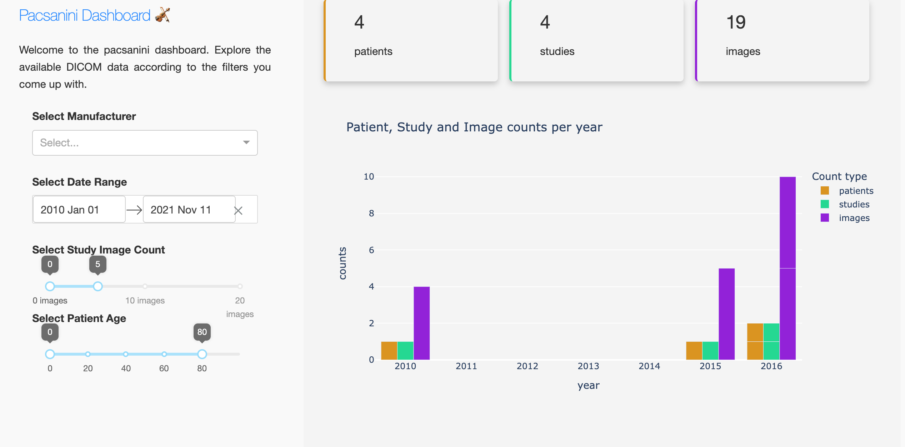

# Visualization

Visualizing data is always helpful to help understand problems and opportunities.
This is why pacsanini comes equipped with a dashboard to help users understand the
data they have collected.

!!! info
    To use the dashboard, you must have configured your backend metadata storage
    resource to be a database. The dashboard will not work with CSV files as their
    data input source.

To start the dashboard, run the following command:

```bash
pacsanini dashboard -f pacsaninirc.yaml
```

This will spawn a server instance listening on port 8050. To change the port,
simply add the `-p <PORT>` option to the command.

You can then visit your browser by going to http://localhost:8050. Below is
an image of what to expect from the dashboard.



The dashboard enables you to query your data backend according to the following
criteria:
* manufacturer: you can select zero or more manufacturer names to filter on
* date range: you can select a specific date range to filter data
* study image count: you can select studies with a specific amount of images
  within them or with a certain range of images
* patient age: you can select only patients within a certain age range
